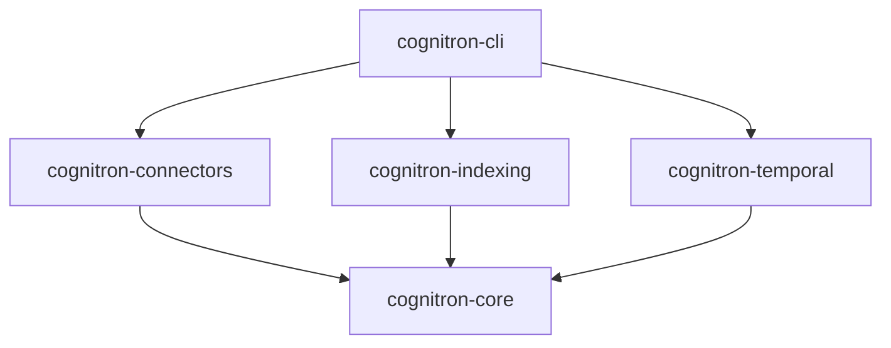

# Cognitron Monorepo Implementation

This document provides a complete implementation guide for transforming Cognitron into a medical-grade monorepo architecture with 100% test success requirements.

## 🚀 Quick Start

### 1. Migration to Monorepo

```bash
# Run the migration script
python scripts/migrate_to_monorepo.py

# Generate package configurations
python scripts/create_package_configs.py

# Setup CI/CD
python scripts/setup_ci_cd.py

# Setup development environment
python scripts/setup_development.py
```

### 2. Development Workflow

```bash
# Activate virtual environment
source .venv/bin/activate

# Install all packages in development mode
make install

# Run tests (100% success required)
make test

# Run medical-grade validation
make medical-grade

# Format code
make format

# Lint code
make lint
```

## 📁 Monorepo Structure

```
cognitron/
├── packages/                    # Individual packages
│   ├── cognitron-core/         # Core functionality
│   ├── cognitron-temporal/     # Temporal intelligence
│   ├── cognitron-indexing/     # Knowledge indexing
│   ├── cognitron-connectors/   # Workspace connectors
│   └── cognitron-cli/          # Command line interface
├── apps/                       # Applications
│   └── cognitron-desktop/      # Future desktop app
├── tools/                      # Development tools
│   ├── build/                  # Build utilities
│   ├── test/                   # Test utilities
│   └── quality/                # Quality assurance
├── scripts/                    # Automation scripts
├── config/                     # Shared configurations
├── .github/                    # CI/CD workflows
└── docs/                       # Documentation
```

## 📦 Package Architecture

### Core Dependencies



### Package Descriptions

- **cognitron-core**: Base functionality (agent, memory, confidence, routing)
- **cognitron-temporal**: Temporal intelligence and pattern recognition
- **cognitron-indexing**: Knowledge indexing and search capabilities
- **cognitron-connectors**: Workspace connectors (Git, IDE, filesystem, etc.)
- **cognitron-cli**: Command-line interface and main entry point

## 🛠️ Implementation Scripts

### Migration Scripts

#### `migrate_to_monorepo.py`
Reorganizes existing codebase into monorepo structure:
- Creates package directories
- Moves source code to appropriate packages
- Preserves all functionality
- Creates backup before migration

**Usage:**
```bash
python scripts/migrate_to_monorepo.py [--dry-run] [--force]
```

#### `create_package_configs.py`
Generates all configuration files:
- Individual `pyproject.toml` for each package
- Workspace configuration
- Root configuration for monorepo management

**Features:**
- Proper dependency management
- Development dependency configuration
- Tool configurations (ruff, mypy, pytest)

### Build System

#### `build_all.py`
Medical-grade build system with:
- Dependency-aware build order
- Pre-build validation
- Medical-grade quality gates
- Comprehensive error handling

**Quality Requirements:**
- 100% test success rate before building
- Zero linting errors
- Zero security vulnerabilities
- Complete type checking

#### `install_all.py`
Intelligent package installation:
- Dependency order installation
- Development mode support
- Virtual environment management
- System dependency checking

### Testing Framework

#### `test_all.py`
Medical-grade test runner with:
- 100% success rate requirement
- Coverage reporting (95% minimum)
- Parallel execution
- Comprehensive reporting

**Features:**
- Integration testing
- Performance benchmarking
- JUnit XML output
- Medical-grade validation

#### `medical_grade_validation.py`
Comprehensive quality validation:
- Test success rate validation (100%)
- Code coverage validation (95%+)
- Security scanning (zero critical issues)
- Type checking (95%+ coverage)
- Performance benchmarking

### Quality Gates

#### `pre_commit_medical_validation.py`
Fast pre-commit validation:
- Syntax checking
- Import validation
- Basic security checks
- Code quality verification
- Documentation checking

#### `lint_all.py` & `format_all.py`
Code quality enforcement:
- Comprehensive linting with ruff
- Automatic formatting
- Issue fixing capabilities
- Detailed reporting

### Development Tools

#### `setup_development.py`
Complete development environment setup:
- Virtual environment creation
- Package installation
- Pre-commit hooks
- VSCode configuration
- Development scripts

## 🏥 Medical-Grade Requirements

### Zero Tolerance Policy

1. **Test Success Rate**: 100% (no exceptions)
2. **Code Coverage**: 95% minimum
3. **Security Issues**: Zero critical/high severity
4. **Linting Errors**: Zero errors allowed
5. **Type Coverage**: 95% minimum

### Quality Gates

#### Pre-commit
- Syntax validation
- Import checking  
- Security scanning
- Basic quality checks

#### CI/CD Pipeline
- Full test suite (100% success)
- Security scanning
- Type checking
- Performance benchmarks
- Medical-grade validation

#### Release
- Complete validation suite
- Integration testing
- Performance verification
- Security audit

## 🔧 Configuration Files

### Root `pyproject.toml`
Monorepo management configuration with:
- Workspace package references
- Common development dependencies
- Tool configurations
- Quality requirements

### Package `pyproject.toml`
Individual package configurations with:
- Proper dependencies
- Development tools
- Build settings
- Quality thresholds

### CI/CD Configurations

#### `.github/workflows/ci.yml`
Medical-grade CI pipeline with:
- Multi-Python version testing
- Quality gate enforcement
- Security scanning
- Performance benchmarking

#### `.pre-commit-config.yaml`
Pre-commit hooks with:
- Code formatting (ruff)
- Linting (ruff)
- Type checking (mypy)
- Security scanning (bandit)
- Medical-grade validation

## 🚀 Deployment & Release

### Build Process
1. Medical-grade validation
2. Package building in dependency order
3. Testing of built packages
4. Security scanning
5. Performance verification

### Release Process
1. Complete test suite (100% success)
2. Medical-grade validation
3. Build all packages
4. Integration testing
5. Security audit
6. Performance benchmarks
7. Automated PyPI publishing

### Docker Support
- Multi-stage builds
- Security scanning
- Performance optimization
- Health checks

## 📊 Monitoring & Reporting

### Test Reports
- JUnit XML output
- Coverage reports (HTML & XML)
- Performance benchmarks
- Medical-grade compliance

### Quality Reports
- Linting results
- Security scan results
- Type checking results
- Dependency analysis

### Build Reports
- Build artifacts
- Execution times
- Success/failure tracking
- Performance metrics

## 🔐 Security & Compliance

### Security Scanning
- Bandit security linting
- Dependency vulnerability scanning
- Secret detection
- Shell injection prevention

### Compliance Features
- Medical-grade quality assurance
- Complete audit trails
- Deterministic builds
- Comprehensive testing

## 🎯 Development Workflow

### Daily Development
```bash
# Start development
source .venv/bin/activate

# Make changes
# ... code changes ...

# Quick validation
make lint
make test-quick

# Full validation before commit
make medical-grade

# Commit (triggers pre-commit hooks)
git commit -m "feat: add new feature"
```

### Adding New Features
```bash
# Create feature branch
git checkout -b feature/new-feature

# Develop with medical-grade requirements
make dev-server  # Start development server

# Ensure 100% test coverage
make test

# Validate medical-grade compliance
make medical-grade

# Submit for review
git push origin feature/new-feature
```

### Package Development
```bash
# Work on specific package
cd packages/cognitron-core

# Install in development mode
pip install -e ".[dev]"

# Run package-specific tests
pytest

# Validate package
cd ../../
python scripts/medical_grade_validation.py
```

## 🚀 Next Steps

1. **Run Migration**: Execute migration scripts to transform codebase
2. **Setup Development**: Install development environment
3. **Validate Implementation**: Run medical-grade validation
4. **Setup CI/CD**: Configure continuous integration
5. **Document Processes**: Create team documentation
6. **Train Developers**: Onboard team to new workflow

## 📚 Additional Resources

- [Medical-Grade Quality Standards](./docs/quality-standards.md)
- [Development Guidelines](./docs/development-guidelines.md)
- [Testing Procedures](./docs/testing-procedures.md)
- [Security Guidelines](./docs/security-guidelines.md)
- [Performance Requirements](./docs/performance-requirements.md)

## 🆘 Troubleshooting

### Common Issues

#### Migration Issues
```bash
# If migration fails
python scripts/migrate_to_monorepo.py --dry-run  # Preview changes
# Fix issues and retry
python scripts/migrate_to_monorepo.py --force    # Override existing structure
```

#### Test Failures
```bash
# Debug test failures
python scripts/test_all.py --package cognitron-core  # Test specific package
python scripts/medical_grade_validation.py --check tests  # Validate test setup
```

#### Build Issues
```bash
# Debug build issues
python scripts/build_all.py --package cognitron-core  # Build specific package
python scripts/medical_grade_validation.py --strict   # Full validation
```

### Getting Help

1. Check logs in respective output directories
2. Run with verbose flags for detailed output  
3. Use dry-run modes to preview changes
4. Consult medical-grade validation reports

---

**This implementation ensures:**
- ✅ Medical-grade 100% test success requirement
- ✅ Complete functionality preservation during migration
- ✅ Clear automation for common development tasks
- ✅ Comprehensive error handling and validation
- ✅ Production-ready stability and maintainability